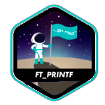

  <h1 align="center" style="border:none"> 👋 Hi, I am Cedric <h1>
  <h3 align="center" style="border:none"> A multiskilled mobile developer<h3>
  

  

    
    
    
    
    
    
    
    
    
    
    
    
    
    
    
    
    
    
    
    
    
    
    
    
    
    
    
    
    
    
    
    
    
    
    
    
    
    
    
    
    
    
  

  

  <h4 align="center">
    👨🏻‍🎓 I’m currently studying at 
    
  </h4>
  

    
    <!--
    
    -->
  

    <h4 align="center">
    📚 I’m currently learning 
    
    
    
     at school
  </h4>
    <table align="center" style="border-spacing: 0px; border-collapse: collapse; margin: 20px;">
			<tr style="border: 2px solid black;">
				<td align="center" colspan="4" style="background-color: black;">
					
Level 0

				</td>
			</tr>
			<tr style="border: 2px solid black;">
				<td align="center" colspan="4" style="width: 100%;">
					<!--
			libft 
			
			-->
					
					

						
						 125 
						 /100 
						
					

				</td>
			</tr>
			<tr style="border: 2px solid black;">
				<td align="center" colspan="4" style="background-color: black;">
					
Level 1

				</td>
			</tr>
			<tr style="border: 2px solid black;">
				<td align="center" colspan="1" style="width: 33%; border: 2px solid black;">
					
					

						
							 100 
							 /100 
						
					

				</td>
				<td align="center" colspan="2" style="width: 33%; border: 2px solid black;">
					
					

						
							 90 
							 /100 
						
					

				</td>
				<td align="center" colspan="1" style="width: 33%; border: 2px solid black;">
					
					

						
							 125 
							 /100 
						
					

				</td>
			</tr>
			<tr style="border: 2px solid black;">
				<td align="center" colspan="4" style="background-color: black;">
					
Level 2

				</td>
			</tr>
			<tr style="border: 2px solid black;">
				<td align="center" colspan="1" style="width: 33%; border: 2px solid black;">
					
					

						
							 125 
							 /100 
						
					

				</td>
				<td align="center" colspan="2" style="width: 33%; border: 2px solid black;">
					
					

						
							 120 
							 /100 
						
					

				</td>
				<td align="center" colspan="1" style="width: 33%; border: 2px solid black;">
					

						
Push_Swap

						
Finished (To be validated)

					

				</td>
			</tr>
			<tr style="border: 2px solid black;">
				<td align="center" colspan="4" style="background-color: black;">
					
Level 3

				</td>
			</tr>
			<tr style="border: 2px solid black;">
				<td align="center" colspan="2" style="width: 50%; border: 2px solid black;">
					

						
Philosophers

						
Started

					

				</td>
				<td align="center" colspan="2" style="width: 50%; border: 2px solid black;">
					

						
MiniShell

						
Started

					

				</td>
			</tr>
		</table>
  

